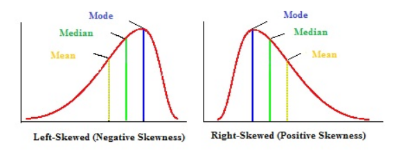
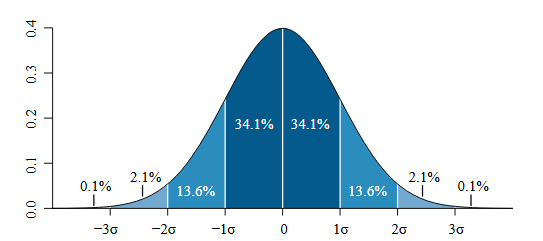
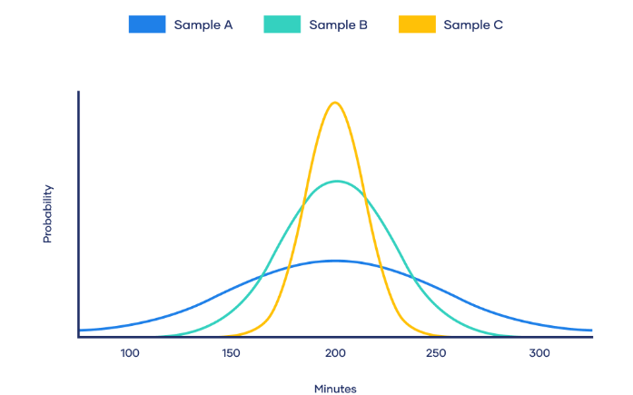

### Descriptive Statistics
Descriptive statistics is a branch of statistics that deals with summarizing and describing the main features of a dataset.

**Measure Central Tendency**:
It helps to describe to what extend the pattern hols for specific numerical variable. 
- Mean - Mean is affected by outliers.
- Median - is not affected by outliers.
- Mode

**_Right Skewed (Mean > Median > Mode)_**
The tail is longer on the right side of the distribution. Most data values are on the left, with a few large values stretching the distribution to the right.

E.g. Income distribution (a few people earn much more than the rest)

**_Left Skewed Mean < Median < Mode_**
The tail is longer on the left side of the distribution. Most values are on the right, with a few very low values dragging the distribution left.

E.g. Retirement age (most people retire around the same age, with a few very early retirements)

**_Symmetrical (Mean = Median = Mode)_**

In a symmetric distribution, the mean, mode, and median are the same. Because of the symmetry, predictions and confidence intervals are easier to calculate.

**Measure of Dispersion (spread)**:
A measure of spread is used to describe the variability in a sample or population. It is used in conjuction with the measure of central tendency to provide overall description of a set of data.

The below picture shows symmetrical distributions with same mean, but they vary. Such variability is what we measure in the dispersion measure.

- Range = Max Value - Min Value
- In-Quartiles (IQR): In Quartiles, the data points are devided into 4 equal parts. 
- Variance: 
- Standard Deviation

Population SD:
$$
\sigma = \sqrt{ \frac{1}{N} \sum_{i=1}^{N} (x_i - \mu)^2 }
$$

Where:

σ = population standard deviation

N = number of data points

x_i = each individual value

μ = population mean

**Measure of Position**:
- Percentile: Values below which a certain percent of observations fall.

**Data Distribution**:
- SKewness: Measures the asymmetry of the distribution.
- Kurtosis: Measures the "tailedness" of the distribution.

**Visualization**:
- Bar
- Pie
- Box
- Scatter Plots
- Histograms